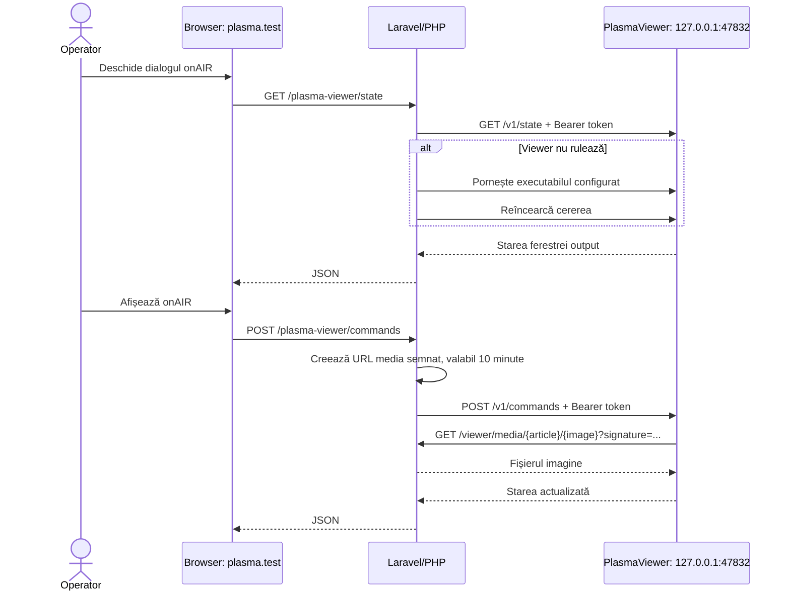

# Conectarea `plasma.test` la PlasmaViewer

Acest document descrie configurația locală prin care aplicația Laravel disponibilă la `http://plasma.test` controlează aplicația desktop Electron din directorul `PlasmaViewer`.

## Rezumat

Cele două aplicații comunică local, prin HTTP:



Browserul nu apelează direct portul `47832`. El comunică same-origin cu Laravel, iar Laravel apelează serverul local al Viewer-ului. Din acest motiv, CORS nu participă la această integrare și tokenul Viewer nu ajunge în codul din browser.

## Condiții necesare

- Laravel/Laragon și PlasmaViewer trebuie să ruleze pe aceeași stație Windows. Adresa Viewer este fixată în cod la `127.0.0.1`; un PHP rulat într-un container sau în WSL ar vedea alt loopback.
- `plasma.test` trebuie să se rezolve local către Laragon. Este important și pentru PlasmaViewer, deoarece acesta descarcă imaginea din URL-ul semnat generat de Laravel.
- Portul configurat trebuie să fie identic în Laravel și PlasmaViewer.
- Tokenul configurat trebuie să fie identic în Laravel și PlasmaViewer.
- Executabilul configurat trebuie să existe dacă lansarea automată este activă.

## Configurarea Laravel

În fișierul `.env` din rădăcina proiectului se folosesc următoarele valori:

```dotenv
APP_URL=http://plasma.test

PLASMA_VIEWER_PORT=47832
PLASMA_VIEWER_TOKEN=<token-local-lung-si-aleator>
PLASMA_VIEWER_EXECUTABLE="C:/Users/<utilizator>/AppData/Local/Programs/PlasmaViewer/PlasmaViewer.exe"
PLASMA_VIEWER_LAUNCH_ENABLED=true
PLASMA_VIEWER_STARTUP_TIMEOUT_MS=5000
```

`PLASMA_VIEWER_TOKEN` nu trebuie comis în Git. Un token nou poate fi generat astfel:

```powershell
php -r "echo bin2hex(random_bytes(32)), PHP_EOL;"
```

După orice modificare a `.env`, configurația Laravel trebuie reîncărcată:

```powershell
php artisan config:clear
```

Rolul fiecărei opțiuni:

| Variabilă | Rol |
|---|---|
| `APP_URL` | Baza URL-ului media semnat pe care PlasmaViewer îl va descărca. Pentru acest setup trebuie să fie `http://plasma.test`. |
| `PLASMA_VIEWER_PORT` | Portul HTTP local al aplicației Electron; implicit `47832`. |
| `PLASMA_VIEWER_TOKEN` | Secret comun trimis ca `Authorization: Bearer ...`. |
| `PLASMA_VIEWER_EXECUTABLE` | Calea absolută către executabilul instalat. Folosirea slash-urilor `/` evită problemele de escapare în `.env`. |
| `PLASMA_VIEWER_LAUNCH_ENABLED` | Permite Laravel să pornească Viewer-ul la prima cerere dacă portul nu răspunde. |
| `PLASMA_VIEWER_STARTUP_TIMEOUT_MS` | Cât timp reîncearcă Laravel după lansare; implicit 5 secunde, la intervale de 200 ms. |

Hostul Viewer nu este configurabil prin `.env` în prezent: `config/plasma_viewer.php` îl fixează la `127.0.0.1`.

## Pornirea PlasmaViewer

### Varianta recomandată: aplicația instalată și lansare automată

Din directorul `PlasmaViewer`, pachetul Windows se construiește astfel:

```powershell
npm install
npm run build
```

Builder-ul scrie artefactele în `PlasmaViewer/release/0.1.0`. Se rulează installer-ul `PlasmaViewer-0.1.0-x64.exe`, apoi se actualizează `PLASMA_VIEWER_EXECUTABLE` cu locația reală instalată.

Cu `PLASMA_VIEWER_LAUNCH_ENABLED=true`, deschiderea dialogului `onAIR` cere starea Viewer-ului. Dacă `127.0.0.1:47832` nu răspunde, Laravel pornește executabilul și îi transmite automat `PLASMA_VIEWER_PORT` și `PLASMA_VIEWER_TOKEN` în mediul procesului.

### Dezvoltare: rulare din surse

Pentru `npm run dev`, variabilele trebuie setate în aceeași sesiune PowerShell înainte de pornire:

```powershell
cd D:\laragon\www\plasma\PlasmaViewer
$env:PLASMA_VIEWER_PORT = "47832"
$env:PLASMA_VIEWER_TOKEN = "<aceeași valoare ca în D:\laragon\www\plasma\.env>"
npm run dev
```

În această variantă este mai clar să se seteze temporar `PLASMA_VIEWER_LAUNCH_ENABLED=false` în Laravel, deoarece procesul Vite/Electron este pornit manual.

PlasmaViewer citește portul și tokenul numai la pornire. După schimbarea uneia dintre valori, aplicația Electron trebuie închisă complet și repornită.

Pornirea manuală prin dublu-click nu primește variabilele din `.env` Laravel. Dacă tokenul Laravel este diferit de valoarea implicită a Viewer-ului, rezultatul va fi `401 Neautorizat`. Pentru rularea instalată, folosiți lansarea automată din Laravel sau setați explicit variabilele în PowerShell înainte de executabil.

## Verificarea conexiunii

### 1. Domeniul Laravel

```powershell
Resolve-DnsName plasma.test
curl.exe --noproxy "*" -I http://plasma.test/
```

Domeniul trebuie să se rezolve la `127.0.0.1`. Un răspuns `302` către `/playlists` este normal pentru ruta principală.

### 2. Serverul local PlasmaViewer

```powershell
Get-NetTCPConnection -LocalPort 47832 -State Listen
curl.exe --noproxy "*" `
  -H "Authorization: Bearer <aceeași valoare din .env>" `
  http://127.0.0.1:47832/v1/health
```

Răspunsul așteptat este:

```json
{"status":"ok","protocolVersion":1}
```

### 3. Fluxul complet din interfață

1. Autentificați-vă în `http://plasma.test`.
2. Deschideți o listă care conține un articol cu imagine.
3. Apăsați `onAIR`. Dialogul interoghează starea la fiecare 2 secunde.
4. Apăsați `Afișează onAIR`.
5. Verificați că fereastra output a PlasmaViewer apare și că luminozitatea, zoom-ul, poziția și flip-ul se actualizează.

Testele de integrare Laravel pot fi rulate separat:

```powershell
php artisan test --filter=PlasmaViewerIntegrationTest
```

## Fluxul implementat în cod

1. `OnAirDialog.tsx` apelează rutele Laravel `viewer.state` și `viewer.command`; ambele sunt protejate de middleware-ul `auth`.
2. `PlasmaViewerController` validează comanda și construiește server-side un envelope de protocol versiunea 1, cu UUID și timestamp.
3. Pentru comanda `show`, Laravel ignoră orice URL trimis de browser și generează o rută media semnată, valabilă 10 minute.
4. `PlasmaViewerClient` trimite comanda la `http://127.0.0.1:<port>/v1/commands`, cu Bearer token. La `ConnectionException`, încearcă lansarea executabilului și repetă cererea.
5. Serverul HTTP Electron ascultă exclusiv pe `127.0.0.1`, compară tokenul în timp constant, validează protocolul și limitează corpul cererii la 64 KiB.
6. Înainte de afișare, Electron descarcă URL-ul media și acceptă numai un răspuns reușit cu `Content-Type: image/*`.
7. Ruta media Laravel verifică semnătura, asocierea curentă articol–imagine și existența fișierului, apoi răspunde cu `private, no-store`.

Endpointurile protocolului local sunt:

| Metodă și rută | Scop |
|---|---|
| `GET /v1/health` | Readiness și versiunea protocolului. |
| `GET /v1/state` | Imaginea activă, transformările, fereastra și monitoarele. |
| `POST /v1/commands` | Comenzi `show`, `transform`, `hide`, `window` și `reset-transform`. |

## Depanare

| Simptom | Cauză probabilă | Verificare/remediere |
|---|---|---|
| `Executabilul PlasmaViewer nu a fost găsit` | Calea din `PLASMA_VIEWER_EXECUTABLE` nu există. | Instalați build-ul și introduceți calea utilizatorului Windows curent; apoi `php artisan config:clear`. |
| `PlasmaViewer nu a pornit în intervalul configurat` | Procesul pornește lent, cade la startup sau portul/tokenul nu corespund. | Porniți-l din terminal pentru a vedea eroarea; măriți temporar timeout-ul numai după ce cauza este cunoscută. |
| `401 Neautorizat` de la `47832` | Token diferit, de obicei Viewer pornit manual fără variabile. | Opriți toate instanțele Viewer și reporniți cu exact tokenul din `.env`. |
| `EADDRINUSE` sau Viewer nu pornește | Alt proces folosește portul. | `Get-NetTCPConnection -LocalPort 47832`; opriți procesul greșit sau schimbați portul în ambele procese. |
| Starea funcționează, dar `show` eșuează la încărcarea imaginii | `APP_URL` greșit, `plasma.test` nu se rezolvă pentru procesul Electron, semnătura a expirat sau fișierul lipsește. | Verificați `APP_URL`, rezoluția domeniului și ruta media semnată; nu reutilizați URL-uri mai vechi de 10 minute. |
| Modificarea `.env` nu are efect | Configurația Laravel este cache-uită sau Viewer rulează cu vechiul mediu. | `php artisan config:clear`, apoi reporniți complet PlasmaViewer. |
| Browserul primește `401` de la rutele `/plasma-viewer/*` | Sesiunea utilizatorului Laravel lipsește/expiră. | Reautentificați-vă în `plasma.test`; aceste rute nu sunt API-uri publice. |

## Starea verificată local la 14 august 2026

La momentul verificării acestui workspace:

- `plasma.test` se rezolvă la `127.0.0.1`;
- `http://plasma.test/` răspunde cu `302` către `/playlists`;
- cele trei rute Laravel ale integrării sunt înregistrate;
- `PLASMA_VIEWER_TOKEN` este setat în `.env` (valoarea nu este reprodusă aici);
- la verificarea inițială, portul `47832` nu asculta; ulterior, Viewer-ul a fost pornit din surse cu tokenul din Laravel, iar `/v1/health` a răspuns cu succes;
- calea `PLASMA_VIEWER_EXECUTABLE` indică profilul Windows `C:\Users\Operator`, iar fișierul nu există pe stația curentă;
- `PlasmaViewerIntegrationTest` trece: 5 teste, 12 aserțiuni.

Conexiunea funcționează în sesiunea de dezvoltare curentă. Pentru ca setup-ul să funcționeze și după oprirea sau repornirea stației, trebuie instalat/construit PlasmaViewer și corectată calea executabilului pentru utilizatorul Windows curent.

## Fișiere relevante

- Laravel: `config/plasma_viewer.php`
- Client HTTP: `app/Services/PlasmaViewer/PlasmaViewerClient.php`
- Lansare automată: `app/Services/PlasmaViewer/PlasmaViewerLauncher.php`
- Controlere: `app/Http/Controllers/PlasmaViewerController.php` și `PlasmaViewerMediaController.php`
- Rute: `routes/web.php`
- UI onAIR: `resources/js/Components/Dialogs/OnAirDialog.tsx`
- Server Electron: `PlasmaViewer/electron/main/viewer/viewerHttpServer.ts`
- Execuția comenzilor: `PlasmaViewer/electron/main/viewer/viewerController.ts`
- Contract protocol: `PlasmaViewer/src/shared/viewer/contracts.ts`
- Protocol succint: `PlasmaViewer/docs/PLASMA_VIEWER_PROTOCOL.md`
